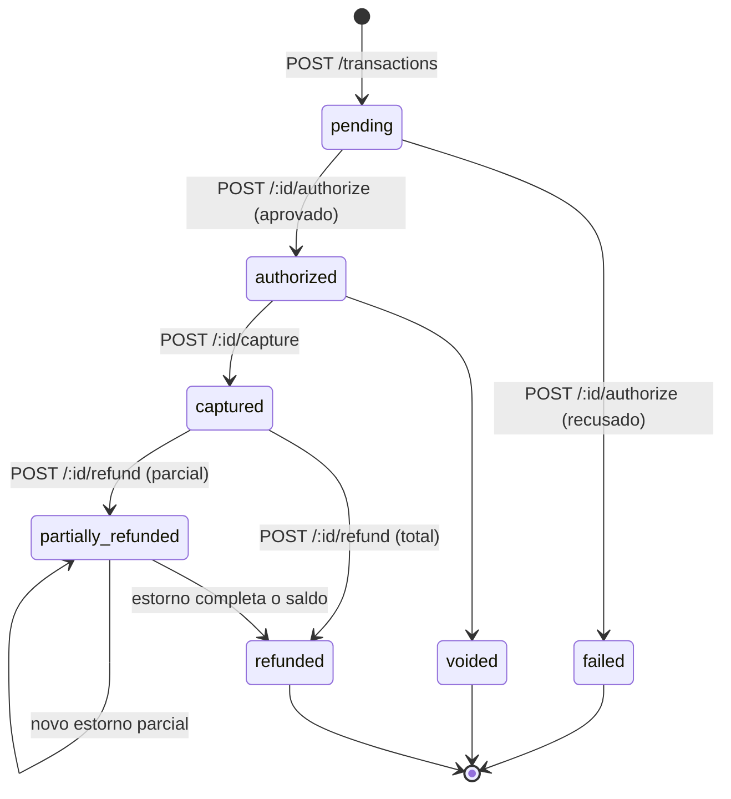

# gateway-pagamento

Simulação de um gateway de pagamentos construída para estudar, na prática, os
problemas reais que esse tipo de sistema precisa resolver: máquina de estados
consistente, idempotência, estornos parciais e um log de eventos confiável.

Não processa cartões de verdade — o objetivo é a **engenharia por trás** de um
fluxo de pagamento: transições de estado controladas, escrita atômica no banco
e simulação determinística de aprovação/recusa.

## Stack

- **NestJS 11** (TypeScript)
- **Prisma 7** com `@prisma/adapter-pg` (driver adapter, sem engine binário)
- **PostgreSQL** via Docker Compose
- **class-validator** / **class-transformer** para validação de entrada
- **Jest** para testes

## Funcionalidades

- **Máquina de estados explícita** para o ciclo de vida da transação, com
  validação de toda transição antes de persistir (ver diagrama abaixo)
- **Idempotência** via `idempotencyKey` único: reenviar a mesma requisição de
  criação retorna a transação já existente em vez de duplicar, inclusive sob
  condição de corrida (tratamento do erro `P2002` do Postgres)
- **Estornos parciais**: uma transação capturada pode ser estornada em várias
  parcelas até o valor total, com o saldo restante recalculado a cada estorno
- **Log de eventos atômico**: toda mudança de estado grava um `Event` na
  mesma transação de banco (`$transaction`) que atualiza a transação — nunca
  existe um estado sem o evento correspondente
- **Simulação de antifraude**: valores acima de R$ 10.000,00 e cartões
  terminados em `0000` são recusados automaticamente na autorização
- **Validação de Luhn** no número do cartão antes de qualquer processamento

## Máquina de estados



Cada transição passa por `assertValidTransition` (`src/domain/transaction-status.ts`)
antes de tocar no banco. Uma transição fora do mapa lança
`InvalidTransitionError`, convertido em `422 Unprocessable Entity` pela API —
não existe caminho para a transação ficar em um estado inconsistente.

## Estrutura

```
src/
  domain/                 # regras de negócio puras, sem dependência de framework
    transaction-status.ts # máquina de estados + validação de transição
    fraud-rules.ts         # regras de simulação de antifraude
    luhn.ts                 # validação de número de cartão
  transactions/
    transactions.controller.ts
    transactions.service.ts # orquestra: valida → transaciona → registra evento
    dto/
  prisma/
    prisma.service.ts       # client global, adapter @prisma/adapter-pg
prisma/
  schema.prisma             # Merchant, Transaction, Refund, Event
```

A separação de `domain/` é proposital: as regras de transição e antifraude
não importam nada do NestJS nem do Prisma, então dá pra testá-las isoladas e
reaproveitá-las se o transporte (REST → outra coisa) mudar.

## Modelo de dados

- **Merchant** — lojista dono das transações (autenticação simplificada por `apiKey`)
- **Transaction** — estado atual, valores, `idempotencyKey` único, `refundedAmount`
- **Refund** — cada estorno parcial ou total, associado à transação
- **Event** — trilha de auditoria: um registro por mudança de estado, com o
  payload completo da transação naquele momento

## Como rodar localmente

Pré-requisitos: Node.js, Docker.

```bash
git clone https://github.com/lucasemanoel3103/gateway-pagamento.git
cd gateway-pagamento
cp .env.example .env        # preencha POSTGRES_USER/PASSWORD/DB e DATABASE_URL
npm install
docker compose up -d
npx prisma generate
npx prisma migrate dev
npm run start:dev
```

A API sobe em `http://localhost:3000`.

> **Nota:** como ainda não há seed, é preciso criar um `Merchant` manualmente
> (via `npx prisma studio`) antes de criar a primeira transação — isso está
> no roadmap abaixo.

## Endpoints

| Método | Rota                          | Descrição                            |
| ------ | ------------------------------ | -------------------------------------- |
| POST   | `/transactions`                 | Cria a transação (idempotente)         |
| POST   | `/transactions/:id/authorize`   | Autoriza (ou recusa via antifraude)    |
| POST   | `/transactions/:id/capture`     | Captura uma transação autorizada       |
| POST   | `/transactions/:id/refund`      | Estorna, total ou parcialmente         |

### Exemplo — criar e processar uma transação

```bash
# 1. Criar transação
curl -X POST http://localhost:3000/transactions \
  -H "Content-Type: application/json" \
  -d '{
    "merchantId": "<uuid-do-merchant>",
    "amount": 5000,
    "currency": "BRL",
    "cardNumber": "4111111111111111",
    "cardBrand": "visa",
    "idempotencyKey": "pedido-123"
  }'

# 2. Autorizar
curl -X POST http://localhost:3000/transactions/<id>/authorize

# 3. Capturar
curl -X POST http://localhost:3000/transactions/<id>/capture

# 4. Estornar parcialmente
curl -X POST http://localhost:3000/transactions/<id>/refund \
  -H "Content-Type: application/json" \
  -d '{ "amount": 2000 }'
```

`amount` sempre em centavos.

## Testes

```bash
npm run test        # unitários
npm run test:e2e    # end-to-end
npm run test:cov    # cobertura
```

## Decisões técnicas

- **Amount em centavos (`Int`)**: evita os problemas clássicos de ponto
  flutuante com dinheiro.
- **Idempotência a nível de banco**: a constraint `@unique` em
  `idempotencyKey` é a fonte da verdade, não só uma checagem em memória — por
  isso o tratamento do erro `P2002` sob corrida.
- **Evento sempre na mesma transação que o estado**: se a escrita do evento
  falhar, a mudança de estado também falha (rollback). Isso evita o cenário
  clássico de "estado mudou mas ninguém ficou sabendo".
- **Regras de domínio sem dependência de framework**: `transaction-status.ts`,
  `fraud-rules.ts` e `luhn.ts` são funções puras — fáceis de testar e de ler
  sem precisar entender NestJS ou Prisma.

## Roadmap

- [ ] Seed inicial (Merchant de teste) para facilitar onboarding
- [ ] Testes e2e cobrindo o ciclo completo (create → authorize → capture → refund)
- [ ] Webhooks assíncronos: disparar `webhookUrl` do Merchant a cada `Event`
      criado (o campo `delivered` em `Event` já existe pensando nisso)
- [ ] Endpoint `GET /transactions/:id` e listagem com filtros

## Licença

MIT
